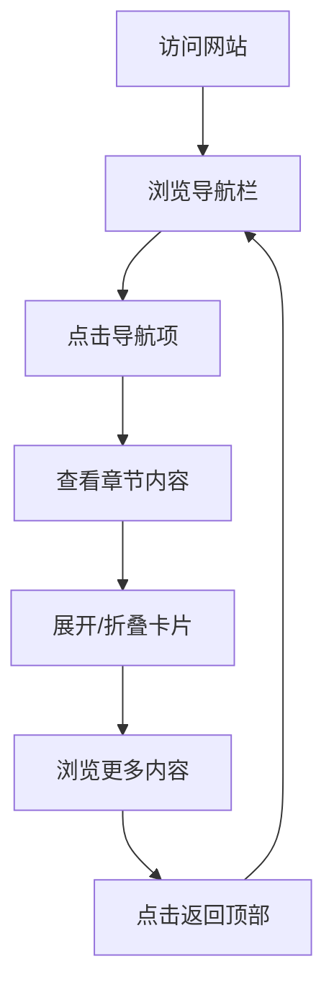

## 1. 产品概述
NOno Cake网站是一个展示蛋糕品牌形象和私域运营方案的单页网站，旨在提升品牌专业度和现代感。
- 主要目的是展示品牌形象、私域运营策略和蛋糕产品，吸引潜在客户和合作伙伴。
- 目标用户为蛋糕消费者、潜在合作伙伴和品牌关注者。

## 2. 核心功能

### 2.1 功能模块
1. **首页**：品牌展示、导航栏、章节内容展示、返回顶部按钮
2. **导航系统**：顶部固定导航栏，包含下拉菜单和章节跳转
3. **内容展示**：分章节展示私域运营方案，包含可折叠的详细内容卡片

### 2.2 页面详情
| 页面名称 | 模块名称 | 功能描述 |
|-----------|-------------|---------------------|
| 首页 | 品牌展示 | 展示NOno Cake品牌标识和名称，营造专业品牌形象 |
| 首页 | 导航栏 | 提供章节导航，包含下拉菜单，支持快速跳转到对应章节 |
| 首页 | 章节内容 | 分章节展示私域运营方案，包含可折叠的详细内容卡片 |
| 首页 | 返回顶部 | 当页面滚动到一定位置时显示，点击可快速返回顶部 |

## 3. 核心流程
用户访问网站 → 浏览导航栏了解网站结构 → 点击导航项查看对应章节内容 → 展开/折叠卡片查看详细信息 → 滚动页面浏览更多内容 → 点击返回顶部按钮快速回到页面顶部

## 4. 用户界面设计
### 4.1 设计风格
- 主色调：暖棕色系（#C4956A）、深棕色（#3D2B1F）、米白色（#FDFBF7）
- 辅助色：浅橙色（#E8A87C）、浅粉色（#F8E8D8）
- 按钮风格：圆角按钮，悬停效果
- 字体：无衬线字体，标题使用更具设计感的字体
- 布局风格：卡片式布局，清晰的层级结构
- 图标风格：简洁、现代，与蛋糕品牌调性匹配

### 4.2 页面设计概览
| 页面名称 | 模块名称 | UI元素 |
|-----------|-------------|-------------|
| 首页 | 品牌展示 | 居中的品牌标识和名称，背景使用柔和的渐变或纹理，营造温馨、专业的氛围 |
| 首页 | 导航栏 | 固定在顶部，深棕色背景，白色文字，下拉菜单使用白色背景，悬停时显示橙色高亮 |
| 首页 | 章节内容 | 卡片式布局，白色背景，轻微阴影，圆角设计，展开/折叠时有平滑动画效果 |
| 首页 | 返回顶部 | 圆形按钮，橙色背景，白色图标，悬停时有轻微放大效果 |

### 4.3 响应式设计
- 桌面优先设计，同时支持平板和移动设备
- 移动设备上导航栏转为汉堡菜单，优化触摸交互
- 卡片布局在小屏幕上调整为单列显示
- 字体大小和间距随屏幕尺寸自动调整

### 4.4 动画效果
- 页面加载时的淡入效果
- 滚动时的视差效果
- 卡片展开/折叠的平滑动画
- 按钮和链接的悬停效果
- 导航栏的滚动变化效果