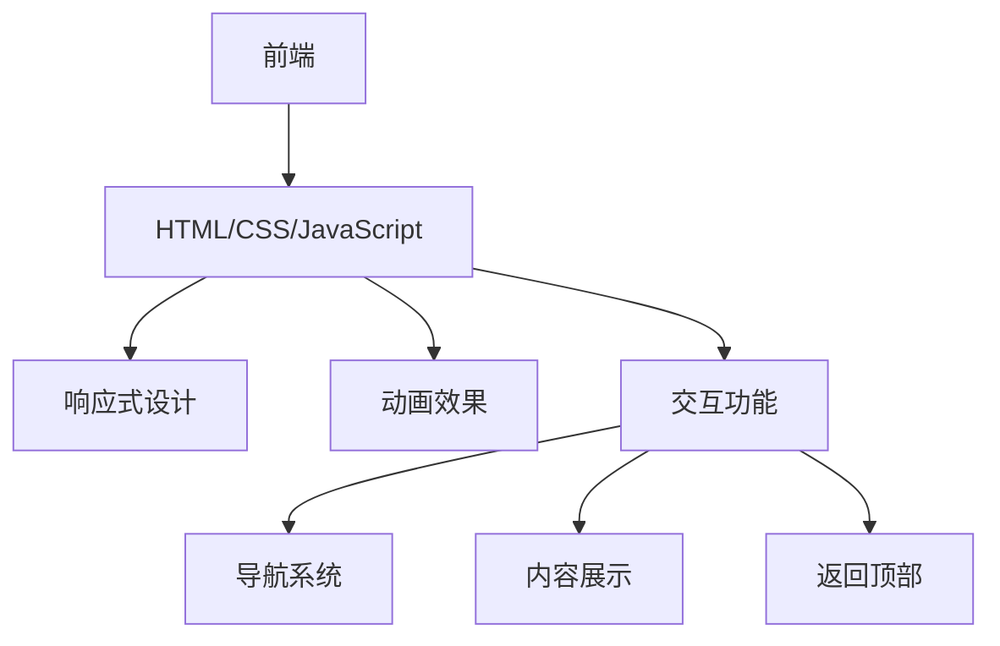

## 1. 架构设计

## 2. 技术描述
- 前端：HTML5 + CSS3 + JavaScript
- 样式框架：原生CSS（使用CSS变量实现主题管理）
- 动画效果：CSS动画 + JavaScript交互
- 响应式设计：媒体查询
- 字体：Google Fonts（选择适合蛋糕品牌的字体）
- 图标：使用内联SVG或字体图标

## 3. 页面结构
| 页面名称 | 路径 | 功能 |
|-----------|------|---------|
| 首页 | index.html | 品牌展示、导航、章节内容展示 |

## 4. 核心功能实现
### 4.1 导航系统
- 固定顶部导航栏
- 下拉菜单实现
- 平滑滚动到对应章节
- 响应式汉堡菜单（移动设备）

### 4.2 内容展示
- 章节分组展示
- 可折叠卡片组件
- 标签系统（方案、结果、原因）
- 平滑展开/折叠动画

### 4.3 动画效果
- 页面加载淡入
- 滚动视差效果
- 悬停动画
- 卡片展开/折叠动画

### 4.4 响应式设计
- 桌面端（>1024px）：多列布局
- 平板端（768px-1024px）：调整布局
- 移动端（<768px）：单列布局，汉堡菜单

## 5. 性能优化
- 内联CSS和JavaScript，减少HTTP请求
- 图片优化（压缩、适当尺寸）
- 延迟加载非关键资源
- 最小化CSS和JavaScript代码

## 6. 实现计划
1. 优化HTML结构，确保语义化
2. 重写CSS，使用CSS变量实现主题管理
3. 增强JavaScript交互功能
4. 添加动画效果
5. 实现响应式设计
6. 测试和优化性能